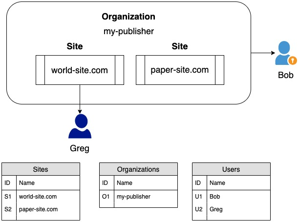
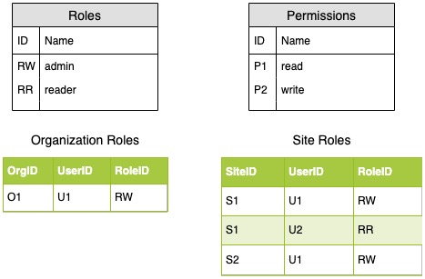

# auth-demo

## Proposed Authentication Flow

The console react application will use AWS Cognito to authenticate and authorize different business users. The following diagram shows an end-to-end experience for a first-time or recently visiting user.

1. The user navigates to the console web page by entering in the URL in the browser.
2. In the react application, the app will look for an access token, if the access token exists it can skip to step 6 to authenticate immediately with the API. If there is no access token present, the app will redirect to the sign-in/sign-up page. At this moment, we can either use the self-hosted UI offered by Cognito or build our own. In this demo, we will build our own using AWS Amplify. It must be noted that this design decision is yet to be finalized.
3. The sign-in page allows for a user to authenticate with Cognito via their preferred Identity Provider. If the user's company preferes SSO, Cognito will redirect the user to its corresponding provider.
4. After a succesful authentication, Cognito returns to the sign-in page with a normalized <b>access</b> and <b>refresh Token</b>. The refresh-token is set as an httpOnly session cookie.
5. The app will then redirect back to the page the user requested
6. The app can now make a backend call. We will use API gateway as a middle man in order to validate the incoming access token.
7. If in the future our business use case requires further validation and/or security API Gateway can leverage an authentication lambda to perform those actions.
8. Once the token and authentication lambda validate sucessfully the client's request can then be consumed by the Node.js application.

### Storing the Access Token and Handling Browser Refresh
There are many options to store the access token. By default, AWS Amplify stores the token in Local Storage. This presents a vulnerability as other cross-site scripts can access this value and then use this token to talk with our backend. To avoid this, we will store this value in a Javascript variable. This will ensure only our client-side application can access it within its scope.

This solution requires additional logic to handle the user refreshing the page as the variable's value will be lost. When this happens the client application will then need to make a request to cognito using the refresh token in order to get the access token. This flow can be seen in the previous diagram between step 5 and 6.

## User Groups

Cognito manages user profiles using a User Pool. This pool can be organized using User Groups. We will have two groups: SuperAdmin and Customer to distinguish between a developer and a business user. We will also add a custom attribute to the User Profile model to distinguish between businesses, for now this will be called `organization`.

By organizing the user pool in this manner we are able to have checks in place at the API Gateway level (using authentication lambdas) and not within the backend application. So, for example, if the API supported an endpoint meant to be accessed only for our Super Users, the backend application will not have to handle this because the request will never make it's way past API gateway.

## Managing Roles and Permissions

In order to manage permissions for each user there will exist tables for Organizations. For every business organization there will be one entry in the Organizations table. One organization can have one or more sites associated with it.

Each organization will have at least one admin. The admin will have the ability to grant access for other users within its organization.

In the following diagram, Bob is a org-level admin for the `my-publisher` organization. Bob can now add Greg, to be an site-level admin for `world-site.com`. For the POC of the auth flow we will not be focused on supporting this functionality but will have the model in place so that future iterations can be possible with fewer schema and architectural changes.

Like the organization table, roles and permissionms will also be maintained separately from the user pool. 

Each role and permission will have an ID and name as attributes. One role can have one or more permissions assigned to it.
TODO: Add relation diagram for Roles-Permissions

For organization roles, there will be an organizationToRole table which will tie the UserID, RoleID and Organziation ID together. When the backend application receives a request to perform an action. The app can then query this table using the user's ID to see if user's role has permission to perform this action. The same logic can be applied to the site role.